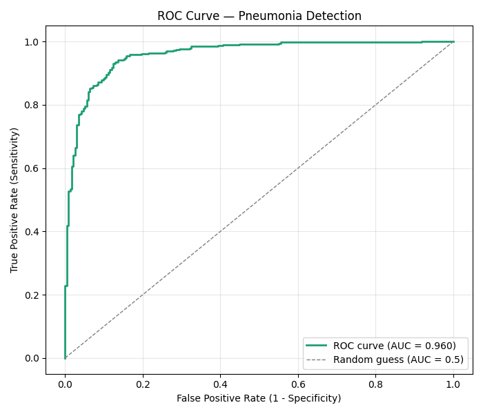
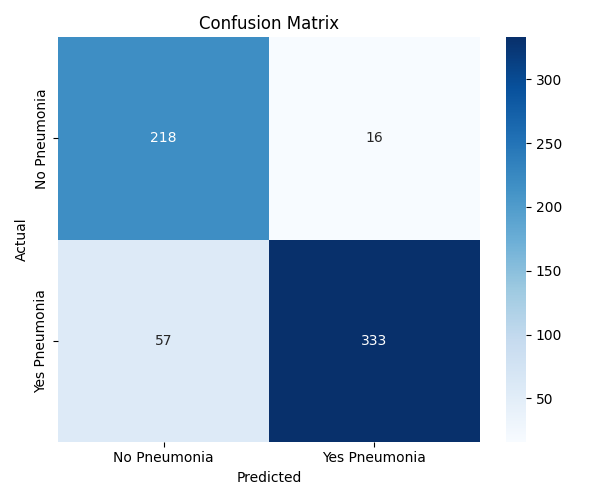
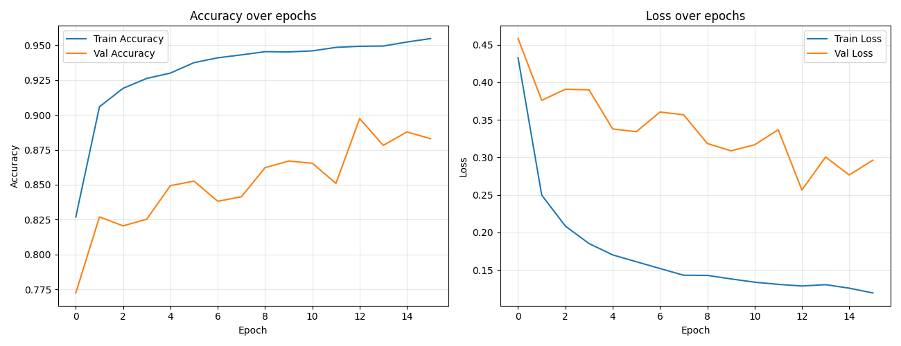
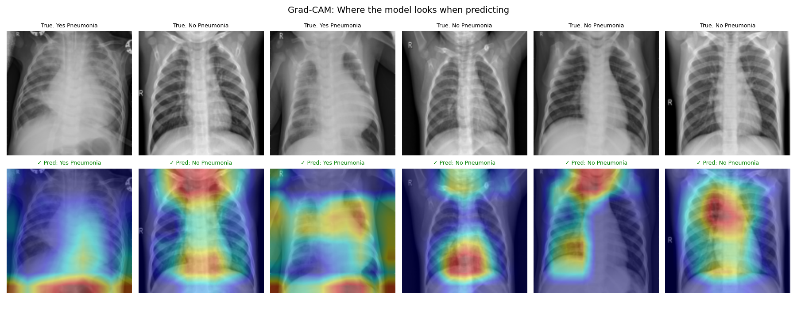

# Pneumonia Detection from Chest X-Rays using CNN Transfer Learning

An end-to-end deep learning pipeline that classifies chest X-ray images as **Normal** or **Pneumonia**, built using transfer learning (VGG16) with class-weighted training, complete clinical evaluation metrics, and Grad-CAM explainability.


---

## Overview

This project detects pneumonia from pediatric chest X-ray images using a convolutional neural network built on top of **VGG16** (pretrained on ImageNet). Rather than discarding data to fix class imbalance, the model uses **class-weighted training** to handle the skew between Normal and Pneumonia cases while preserving the full dataset.

The pipeline goes beyond simple accuracy — it includes a complete clinical evaluation (sensitivity, specificity, AUC-ROC) and **Grad-CAM** visual explainability to verify the model is learning genuine lung pathology rather than spurious shortcuts.

## Dataset

- **Source:** [Chest X-Ray Images (Pneumonia)](https://www.kaggle.com/datasets/paultimothymooney/chest-xray-pneumonia) — Kaggle, originally from Kermany et al., *Cell* (2018)
- **Classes:** `NORMAL`, `PNEUMONIA`
- **Split:** Train / Validation / Test (provided by the original dataset)
- **Note:** Classes are imbalanced (~3x more Pneumonia images than Normal), addressed via `class_weight` during training rather than undersampling.

## Methodology

| Step | Approach |
|---|---|
| Preprocessing | Resize to 150×150, normalize pixel values |
| Augmentation | Random rotation, zoom, and translation (training only) |
| Architecture | VGG16 (frozen, ImageNet weights) + Flatten + Dense(2, softmax) |
| Class imbalance | `class_weight='balanced'` (no data discarded) |
| Optimizer | RMSprop, learning rate 0.0001 |
| Regularization | EarlyStopping on validation loss |
| Explainability | Grad-CAM on the last VGG16 conv layer (`block5_conv3`) |

## Results

| Metric | Score |
|---|---|
| **Accuracy** | 0.8830128205128205 |
| **Sensitivity (Recall)** | 0.8538461538461538 |
| **Specificity** | 0.9316239316239316 |
| **AUC-ROC** | **0.959** |
| **F1 Score** |  0.9012178619756427 |

> Sensitivity and specificity are reported separately from accuracy because, in a medical screening context, missing a true pneumonia case (false negative) carries far higher clinical risk than a false alarm (false positive). Accuracy alone can mask this on an imbalanced dataset.

### ROC Curve


### Confusion Matrix


### Learning Curves


A moderate train/validation gap is visible, indicating mild overfitting — expected given dataset size. Despite this, the model retains strong discriminative performance (AUC = 0.959), suggesting good generalization in ranking risk even where confidence calibration could improve.

## Explainability — Grad-CAM



Grad-CAM heatmaps highlight the image regions most responsible for each prediction. For Pneumonia-positive cases, attention consistently concentrates on lung regions — supporting the idea that the model has learned clinically plausible features rather than relying on image artifacts (borders, text labels, or scan markers). For Pneumonia-negative cases, attention patterns are more variable, which likely reflects the inherent difficulty of localizing the *absence* of an abnormality rather than a model failure.

**Limitation:** Grad-CAM shows *where* the model is looking, not *why* — it does not confirm detection of specific radiological signs (e.g. consolidation, air bronchograms). This distinction is noted as an open limitation rather than an overclaim.

## Project Structure

```
pneumonia-detection-cnn/
├── notebooks/
│   ├── 01_eda_preprocessing.ipynb
│   └── 02_training_evaluation.ipynb   
├── results/
│   ├── confusion_matrix.png
│   ├── roc_curve.png
│   ├── learning_curves.png
│   ├── gradcam_examples.png
│   └── results_summary.json
└── README.md
```

> **Note on model weights:** The trained model file (`pneumonia_model.keras`) is not included in this repository due to GitHub's file size limits. [Download it here](#) https://drive.google.com/file/d/1TJwx7F4ZS-ZEs8EPjkZCpplJjrsKIGUo/view?usp=sharing

## How to Run

1. Open `notebooks/pneumonia_detection.ipynb` in Google Colab
2. Download the dataset from Kaggle (`paultimothymooney/chest-xray-pneumonia`)
3. Run all cells in order — training takes approximately 15–20 minutes on Colab's free GPU
4. Trained model, charts, and metrics are saved automatically at the end

## Limitations & Future Work

- Dataset is pediatric-only; generalization to adult chest X-rays is untested
- Mild overfitting observed (see learning curves) — could be reduced with fine-tuning the last few VGG16 layers or stronger regularization
- Grad-CAM confirms plausible attention regions but not specific radiological criteria
- A held-out external dataset would strengthen generalization claims

## Tech Stack

`Python` · `TensorFlow/Keras` · `VGG16` · `scikit-learn` · `OpenCV` · `Matplotlib` · `Seaborn`

## License

MIT License — see [LICENSE](LICENSE) for details.

---

*Built as part of an AI for Medical Imaging coursework project.*
